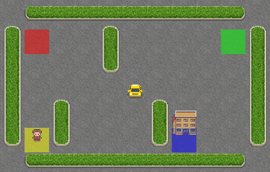
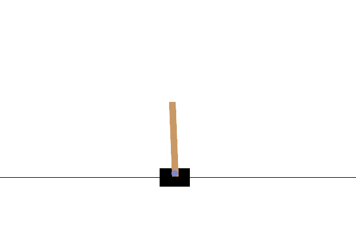
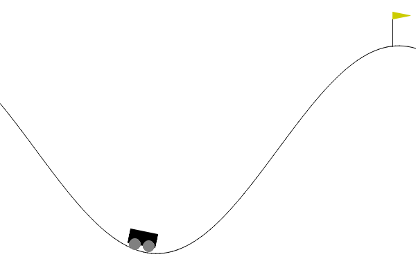
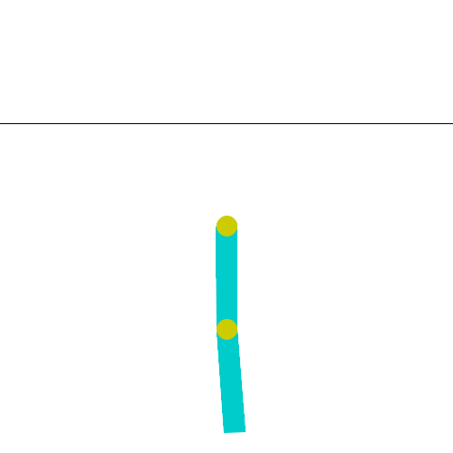
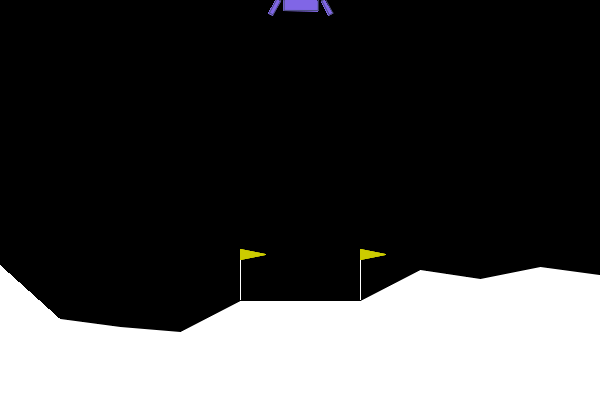
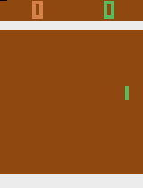

# RL-Implementations


## Introduction

RL-Implementations features the implementation of various Reinforcement Learning algorithms designed to solve standard Gymnasium environments. It covers the transition from basic tabular methods to deep neural network-based models for continuous control. The goal of this project is to provide a clean and simple reference for how different RL agents learn to interact with their environments.

---

## 📁 File Structure

```

RL-Implementations/
├── Q-Learning/                  # Off-Policy Tabular Model-Free RL
│   ├── QL/                      # Classic Q-Table 
│   ├── DiscretizedQL/           # State binning 
│   └── TileCodedQL/             # Tile Coding 
├── SARSA/                       # On-Policy Tabular Model-Free RL
├── Deep-Q-Learning/             # Value-Based Deep RL
│   ├── Unvectorized/            # Standard sequential execution
│   └── Vectorized/              # Parallelized environments for high throughput
├── Double-Deep-Q-Learning/      # Improved DQN
│   ├── Unvectorized/
│   └── Vectorized/
├── PPO/                         # Proximal Policy Optimization (On-Policy Continuous)
├── DDPG/                        # Deep Deterministic Policy Gradient (Off-Policy Continuous)
├── TD3/                         # Twin Delayed DDPG (Off-Policy Continuous)
├── Soft-Actor-Critic/           # Maximum Entropy Actor Critic (Off-Policy Continuous)     
├── assets/                      # Evaluation test GIFs
├── LICENSE                      # MIT License
└── README.md                    # Project Documentation

```

---

## ⚙️ Algorithms & Environments

| Algorithm Category | Specific Implementation | Environments Solved | Action Space |
| --- | --- | --- | --- |
| **Tabular RL** | Standard Q-Learning | `BlackJack-v1`, `FrozenLake-v1` | Discrete |
|  | Discretized Q-Learning | `CartPole-v1`, `Pendulum-v1` | Continuous (Discretized) |
|  | Tile-Coded Q-Learning | `MountainCar-v0`, `CartPole-v1` | Continuous (Approximated) |
| **SARSA** | Standard SARSA | `CliffWalking-v0`, `Taxi-v3` | Discrete |
| **Deep RL (Value)** | Deep Q-Learning (DQN) | `Acrobot-v1`, `LunarLander-v3` | Discrete |
|  | Double DQN (DDQN) | `LunarLander-v3`, `ALE/Pong-v5` | Discrete (Visual/RAM) |
| **Deep RL (Policy)** | Proximal Policy Optimization (PPO) | `BipedalWalker-v3`, `CartPole-v1` | Continuous / Discrete |
|  | Deep Deterministic Policy Gradient (DDPG) | `Pendulum-v1`, `BipedalWalker-v3` | Continuous |
|  | Twin Delayed DDPG (TD3) | `BipedalWalker-v3`, `Humanoid-v5` | Continuous |
|  | Soft Actor-Critic (SAC) | `HalfCheetah-v5`, `Ant-v5` | Continuous |

---

## 🎥 Showcase

| Environment | Algorithm | State/Action Space | Demonstration |
| --- | --- | --- | --- |
| **FrozenLake-v1** | Q-Learning | Discrete (16 States, 4 Act) |  |
| **Taxi-v3** | SARSA | Discrete (500 States, 6 Act) |  |
| **CartPole-v1** | Discretized Q-Learning | Continuous (4 Obs, 2 Act) |  |
| **MountainCar-v0** | Tile-Coded Q-Learning | Continuous (2 Obs, 3 Act) |  |
| **Acrobot-v1** | DQN (Unvectorized) | Continuous (6 Obs, 3 Act) |  |
| **LunarLander-v3** | DQN (Vectorized) | Discrete (8 Obs, 4 Act) |  |
| **ALE/Pong-v5** | Vectorized DDQN | Discrete (Visual Pixels) |  |
| **Pendulum-v1** | DDPG | Continuous (3 Obs, 1 Act) |  |
| **BipedalWalker-v3** | PPO | Continuous (24 Obs, 4 Act) |  |
| **Humanoid-v5** | TD3 | Continuous (376 Obs, 17 Act) |  |
| **Ant-v5** | SAC | Continuous (27 Obs, 8 Act) |  |

---

## 🚀 Getting Started

Follow these steps to set up the environment and run any of the RL agents locally.

**1. Clone the repository and install dependencies** : 

Ensure you have Python 3.10+ installed. Install the required libraries, including the MuJoCo and Gymnasium physics engines:

```

git clone https://github.com/amimayo/RL-Implementations.git
cd RL-Implementations
pip install -r requirements.txt

```

**2. Navigate to the desired algorithm and environment** :

Move into the directory of the specific algorithm you want to test. 

```

cd Soft-Actor-Critic/Ant

```
*Note: For `Deep-Q-Learning` and `Double-Deep-Q-Learning`, you will need to navigate one level deeper to choose between the sequential or parallelized environments (e.g., `cd Deep-Q-Learning/Acrobot/Unvectorized`).*

**3. Run the environment** :

Execute the Python script to watch the trained agent interact with the environment.

```

python ant.py

```

---

## 🛠️ To-Do List

* [🟨] **Complete Simulation:** Run and verify full simulations for all remaining implementations
* [🟩] **Soft Actor-Critic (SAC):** Implement Soft Actor-Critic for highly sample-efficient continuous control (targeting MuJoCo locomotion).
* [🟨] **Monte Carlo Tree Search (MCTS):** Implement a Model-Based RL Algorithm

---

## 📜 License

Distributed under the MIT License.

---